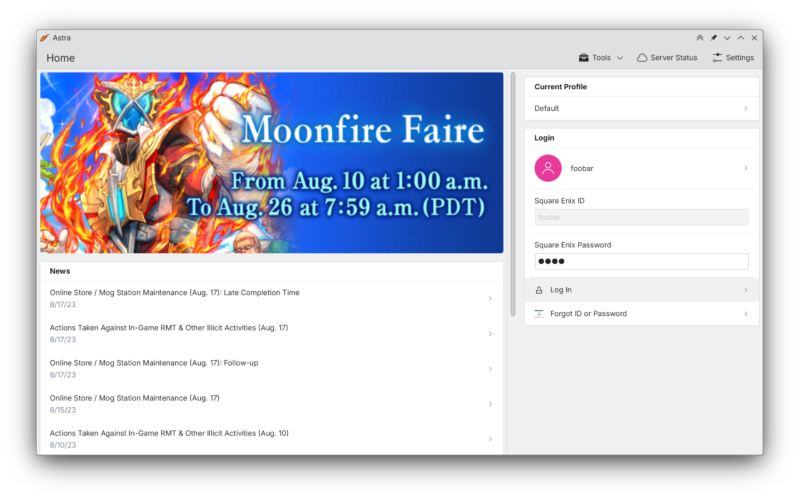

A FFXIV launcher that supports multiple profiles and Dalamud plugins. It also supports Windows, macOS and Linux natively!

I recommend reading up the [FAQ](/astra/faq).










## Get Involved & Support








