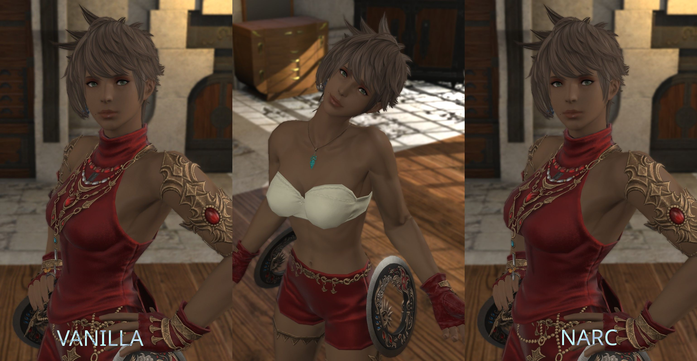

Are you annoyed that some armor somehow changes your female character's chest? Try NARC!

It works around weight painting issues in certain chest pieces by over-scaling the chest bones. Yes it's a giant hack but it works without modifying the gear models themselves. This is done using my plugin [Refitter]().

## Instructions

1. Download and install the [Refitter plugin]().
2. Open the Refitter configuration window by typing "/refitter" in chat, or by using the Dalamud Plugin Installer window.
3. Click the "Download" button below. Once the file is downloaded, copy the _text data_ to your clipboard - not the file itself.
4. Back in the Refitter config window: Under the "Data" tab, click the "Import to Clipboard" button.
5. You're all done!

## Caveats

This mod is still a work-in-progress. Here's some things to note:

* Some armor is too broken to be "fixed" through Refitter alone, eventually I will release fixed gear models for these.
* There's no way to tell which version of NARC you have installed yet. If you notice some armor is missing refits, try re-importing.

## Get Involved & Support





## Frequently Asked Questions

### How is this different than VARC?

VARC does the same thing, but through manually fixing the weight painting on the gear model themselves. While this works (assuming I fixed it, and not making it worse) it's very time consuming. As mentioned in the caveats, I may have to release a mini-VARC to fix some really broken models like the 2B outfit.

A secondary and less important reason is to prevent breakages during game updates. Previously, VARC depended on Penumbra to update first. And now with the graphical update ongoing, gear models could be changed from underneath us!

Refitter is much simpler to update in comparison, and NARC needs no updates itself unless any gear's weight painting changes.

### Can I selectively apply this to certain characters?

I have no plans to build that feature into Refitter at the moment.

### What is the difference between Refitter and NARC?

Refitter is the Dalamud plugin I created to modify the chest bones, it technically has nothing to do with NARC. NARC is just a configuration file for it I've been tweaking.

### Can I create my own refits or modify yours?

Yes! Refitter includes a live, in-game system to do this. You also have the option of exporting your configuration portably to share.

### Why did you make another stupid, useless mod??

I don't care what you think :)
